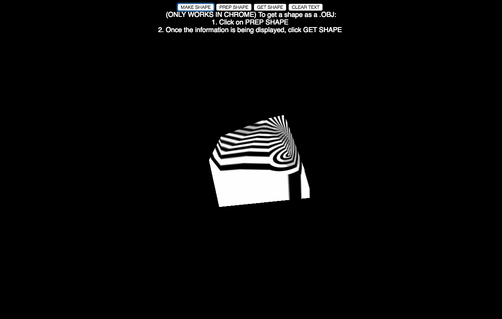
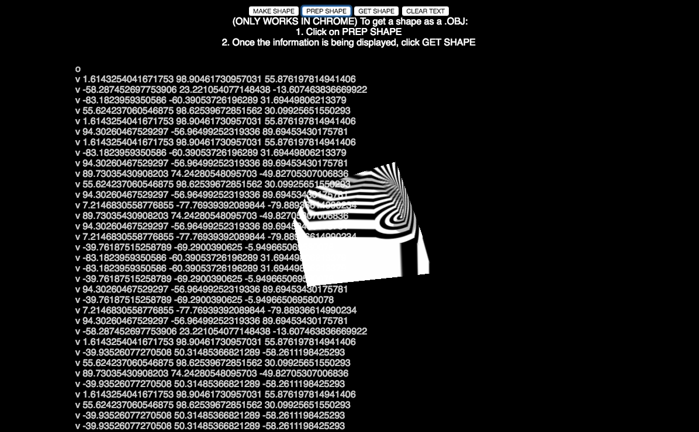
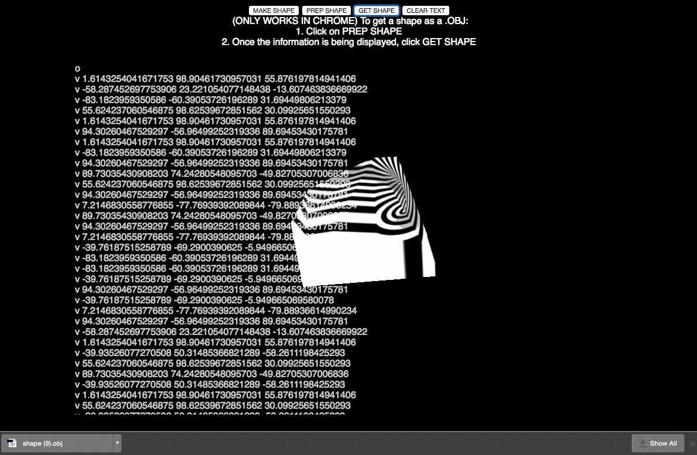
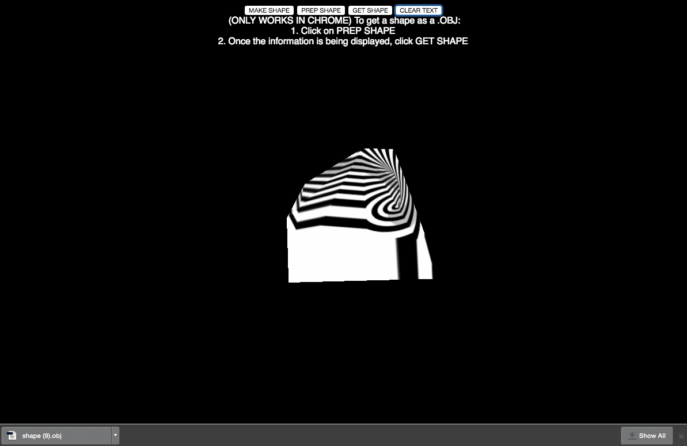
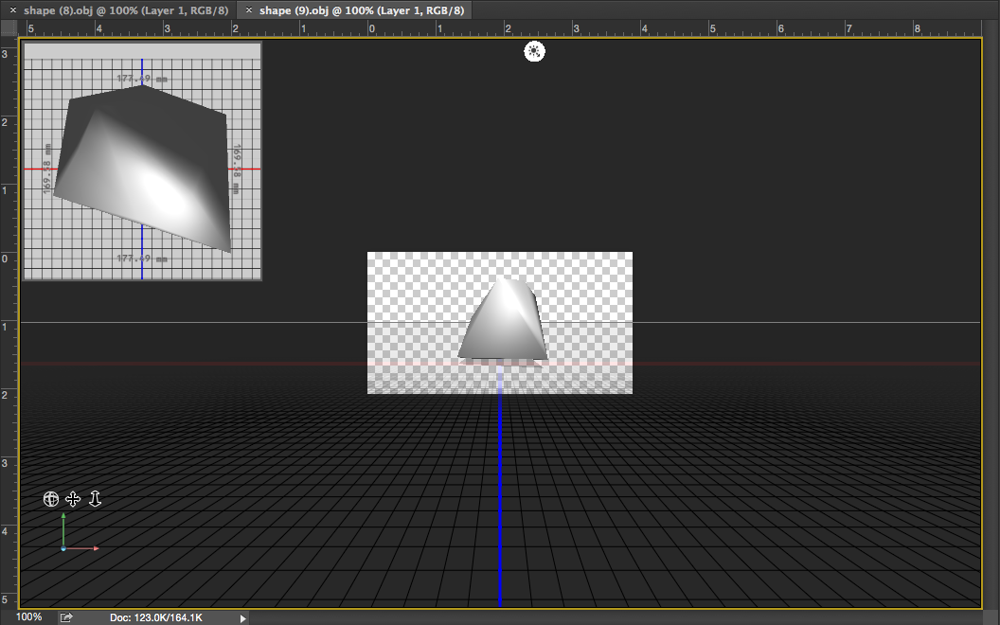

#INTERNUGS

##Synopsis
A 3js experiment by dangeroux and diebenjidie
Essentially a website that generates random 3D shapes to download as OBJs.
Currently the download function only works on Chrome

##Motivation
The website serves as a random object generator, it's great for any project that needs fill space or experiment with 3D objects
e.g. filling an environment in Unity for a more dynamic game

##Installation
http://danielgiroux.net/netart/netart/

##Example Use
Click Make Shape

Click Prep Shape

Click Get Shape it downloads the .obj

Clear Text

Open it up in your favorite .obj editor!

##License
GNU License
